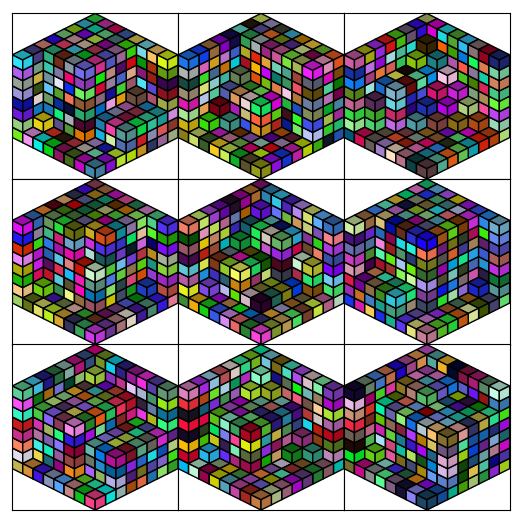

# Miscellaneous scripts

A collection of various scripts - for exampling sampling from a distribution of monotone lozenge tilings or visualizing a 2D projection of the loss landscape of neural net.

